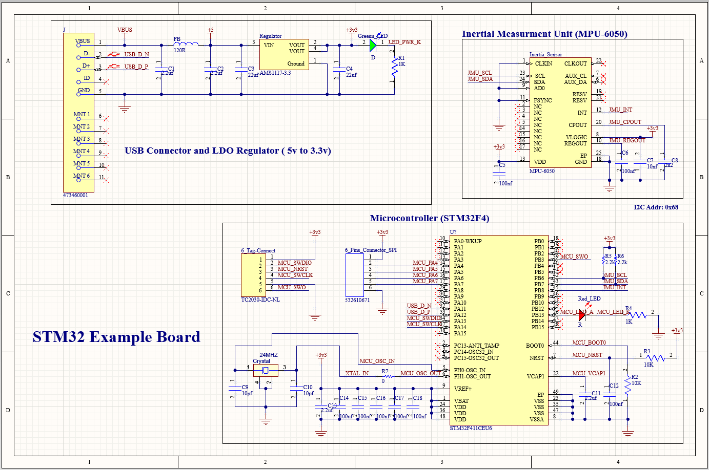
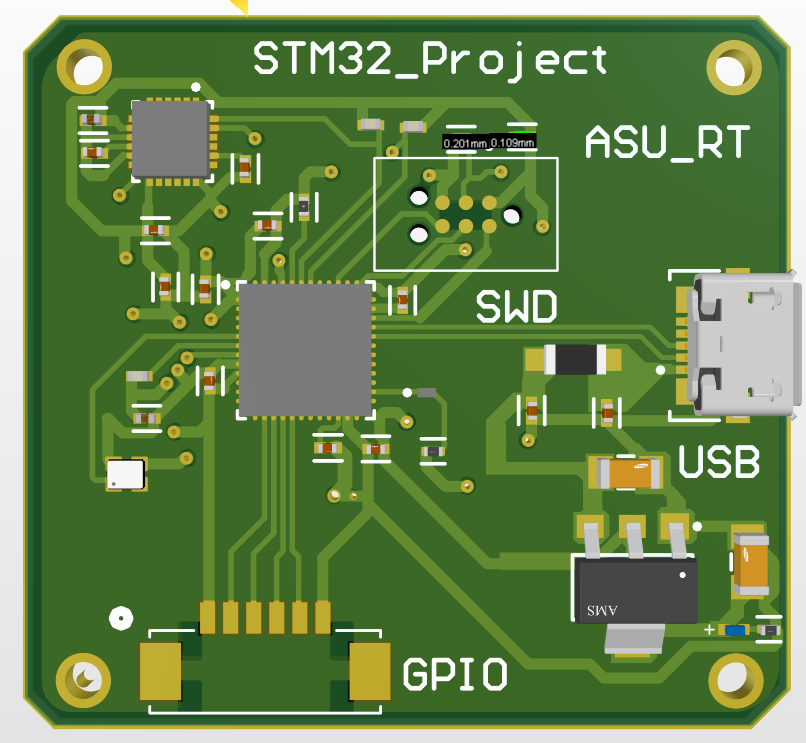
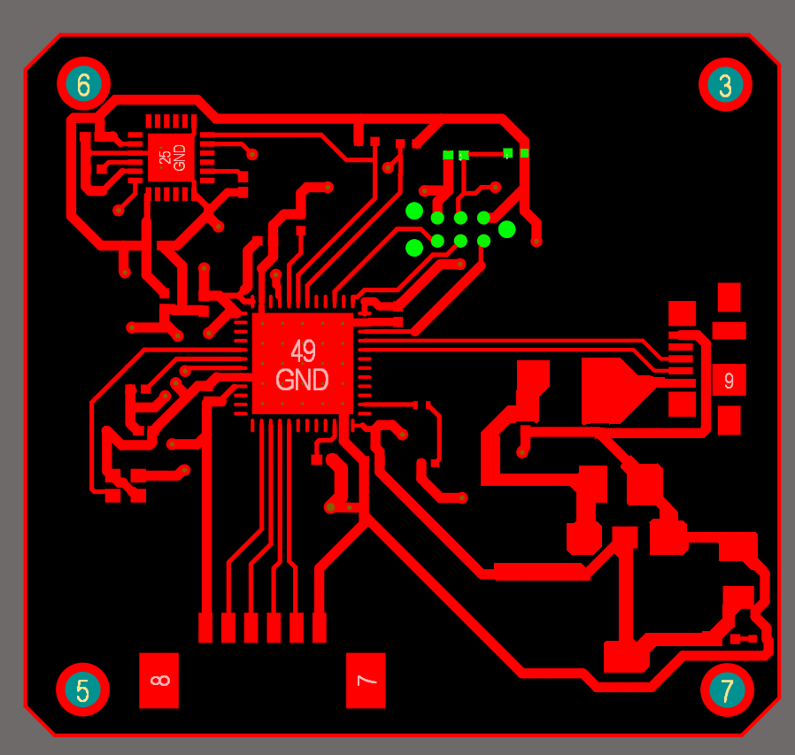

# 🏎️ ASU Racing Team - STM32 Low Voltage Controller
**Comprehensive Hardware Design & Firmware Simulation Projects**

---

## ⚡ Hardware Development: Custom PCB Design
The complete hardware design architecture for the STM32-based controller, meticulously routed and prepared for manufacturing.

### 📂 Project Files
- **Source:** `STM32_PCB.PcbDoc` (Altium Designer source file).
- **Manufacturing:** `STM32_PCB_Gerber.zip` (Ready-to-manufacture Gerber files).
- **Schematic:** Standardized circuit blueprint.

### 🖼️ Hardware Previews

| Schematic Design | PCB Routing (Top/Bottom) | 3D Board Layout |
| :---: | :---: | :---: |
|  |  |  |
| *Circuit Architecture* | *Copper Traces* | *Final 3D Overview* |

---

## 🚀 Milestone 1: Firmware & Simulation (STM32 Blinking LED)
This section demonstrates the fundamental GPIO configuration and hardware simulation of an **STM32F103 (Blue Pill)**.

### 🛠️ Technical Details
- **Environment:** Code generated and compiled via STM32CubeIDE (`main.c`, `.ioc`).
- **Configuration:** `PB12` configured as `GPIO_Output` using STM32 HAL Libraries.
- **Simulation:** Real-time execution and waveform analysis in Proteus (using the compiled `.hex` file).

### 📸 Simulation Preview

| Proteus Circuit & Oscilloscope | Live Simulation Video |
| :---: | :---: |
|  | <video src="https://github.com/user-attachments/assets/e00df9db-ebab-4cea-9730-7a44035782d5" width="450" controls></video> |
| *Square wave generation analyzing HIGH/LOW states* | *Click to play the hardware simulation record* |

<b>Engineered with 💡 by Abdullah Elgendy</b>  
<i>ASU Racing Team</i>

